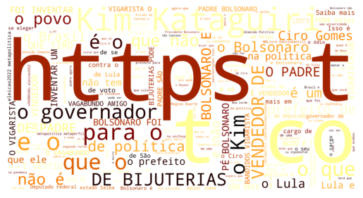
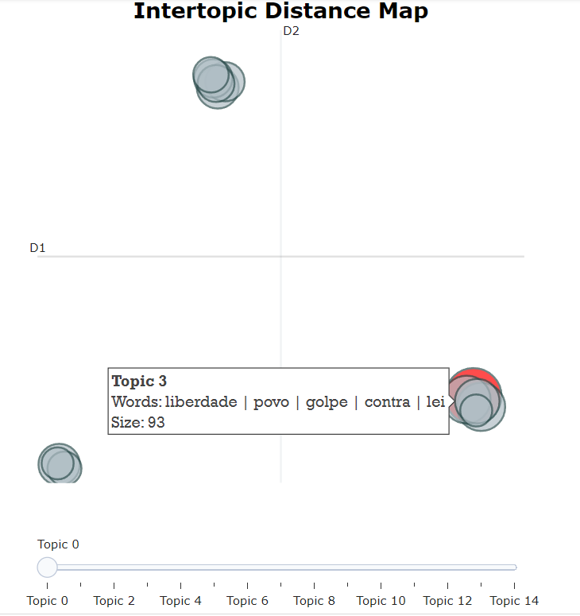

# Twitter Politics Analysis

This project was developed during the course "[SCC0634] Applications of Artificial Intelligence" at the University of São Paulo (USP). The objective was to collect data from Twitter using its API and assemble a dataset related to politics, as the project's development year coincided with the presidential election year in Brazil. It is known that Brazilian politics is very turbulent and controversial, so I decided to analyze the data and predict what Twitter users thought about each candidate. Thus, the goal is to perform an analysis of the collected data and predict the sentiment of a given comment as negative, neutral, or positive.

# Methods

## Data collection

One thing I had never done before was actually obtain all the data used and also classify it manually. To have this experience, I used the tweepy package to access the API and classified the data in the file "getData.py".

## Data analysis

In this stage, several aspects were analyzed to understand the behavior of the data and evaluate its quality. It was checked for null values, the number of data points, the number of words per text, the quantity of each class, and also a word cloud was created with the most frequent words.

## Preprocessing

In practice, this step was not necessary as BERT was used, which does not require data preprocessing. However, for didactic purposes, this step was performed.

Instances with undesired classes, emojis, '@' and '#', as well as 'http' were removed. Everything was also converted to lowercase. In this case, other preprocessing steps could have been performed, but that was not the objective of this project.

## Topics

Furthermore, the BERT topic was also used to cluster the texts into topics in an unsupervised manner. The result was not as satisfactory as desired, as it requires good preprocessing to work excellently. This involves removing essentially all terms that are not important or relevant to the analyzed topic.

Nevertheless, it is possible to synthesize the topics into a graph, as shown below.

## Classification

In this step, BERT was used, specifically the "distiluse-base-multilingual-cased-v1" model, which is a compact and optimized version. This allowed us to convert textual data into numbers so that machine learning algorithms can process such data.

After that, data oversampling was performed using SMOTE because the class distribution showed a significant imbalance, requiring a technique to minimize this problem.

Next, the data was sent to the machine learning algorithms, specifically KNN and AdaBoost. Different parameters were tested for each model, and the best parameters for each model were selected.

# Results

AdaBoost performed better, which was expected since it is a more robust model that can extract more information from the data.
